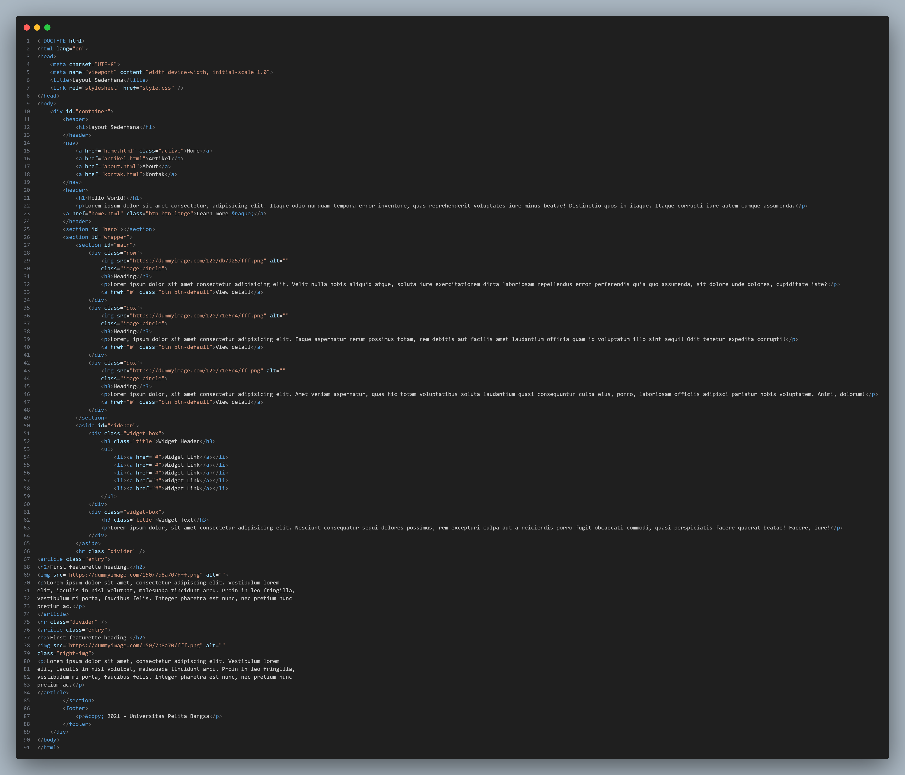
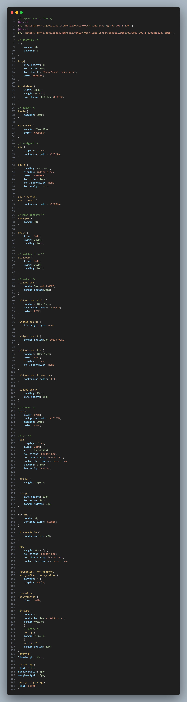
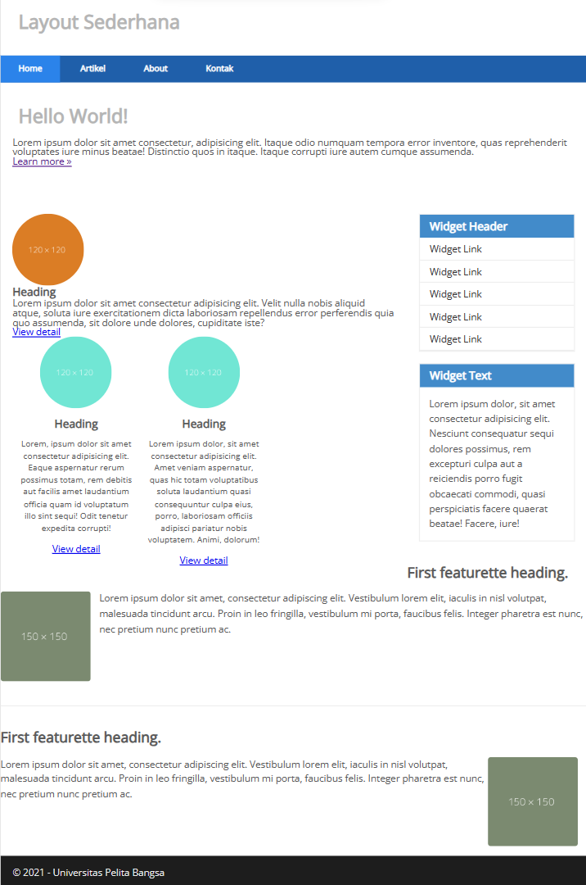

# Lab6web
# Nama : Mohamad Hegar Sukmana Wibowo
# Kelas : TI.22.A3
# NIM : 312210332

## Instruksi Praktikum
1. Persiapkan text editor misalnya VSCode.
2. Buat folder baru dengan nama lab6_css_framework
3. Buat file baru dokumen html
4. Buat struktur dasar dari dokumen HTML.
5. Buatlah layout web sederhana menggunakan css framework (Twitter Bootsrtap).
6. Lakukan validasi dokumen html dengan mengakses http://validator.w3.org
Berdasarkan gambar layout web berikut, buatlah menggunakan Twitter Bootstrap.

* file lab6_css_framework.html

* file style.css

* hasil output

## Laporan Praktikum
1. Buatlah repository baru dengan nama Lab6Web.
2. Kerjakan semua latihan yang diberikan sesuai urutannya.
3. Screenshot setiap perubahannya.
4. Buatlah file README.md dan tuliskan penjelasan dari setiap langkah praktikum beserta screenshotnya.
5. Commit hasilnya pada repository masing-masing.
6. Kirim URL repository pada e-learning ecampus